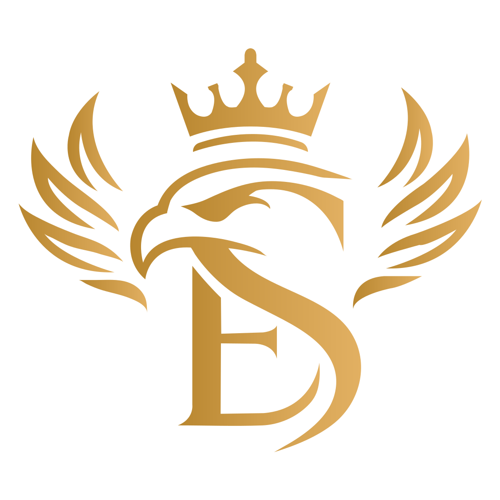
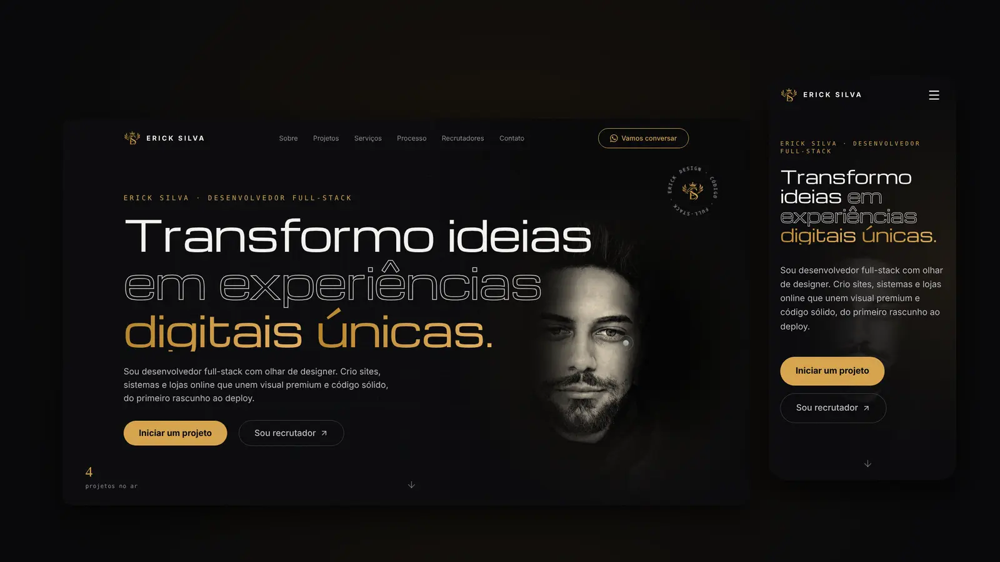
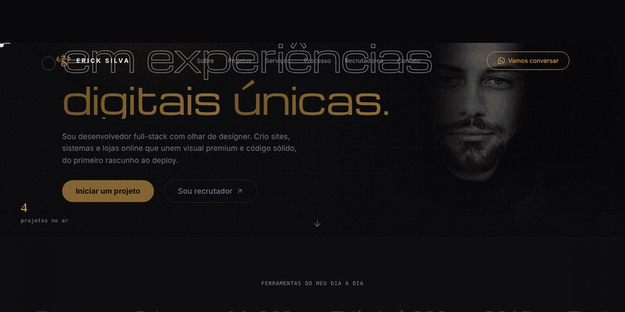
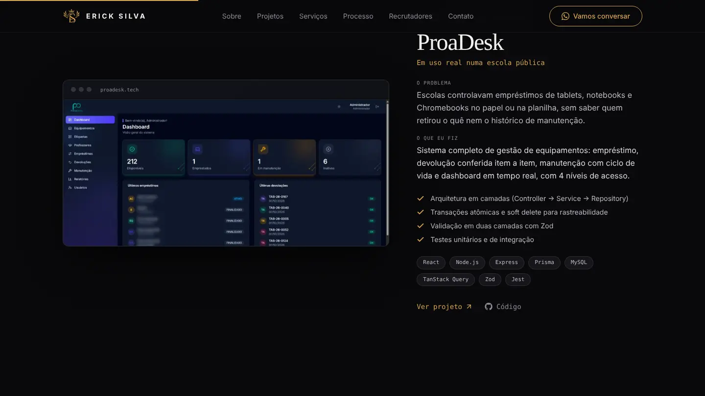
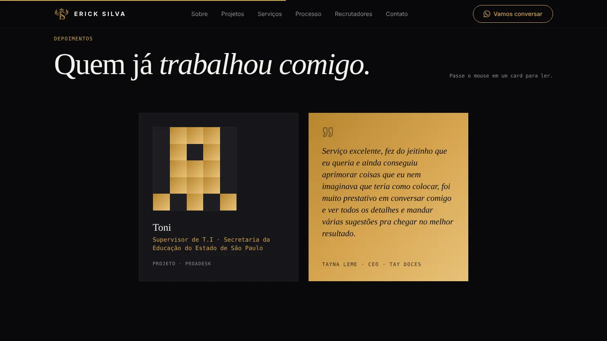

<div align="center">

<a href="https://ericksilva.dev">
  
</a>

# Erick Silva — Portfólio

**Transformo ideias em experiências digitais únicas.**

Um portfólio que fala com dois públicos: quem avalia código e quem nunca escreveu uma linha dele,<br/>mas tem um negócio que pode crescer com tecnologia.

<br/>

[](https://ericksilva.dev)
[](https://www.linkedin.com/in/ericklarssen)
[](https://github.com/ErickLarssen)

<br/>

<a href="https://ericksilva.dev">
  
</a>

</div>

<br/>

## ◈ A ideia

A maioria dos portfólios de desenvolvedor conversa apenas com recrutadores. Este conversa também com o **Seu Zé da padaria**, com a **dona da floricultura** e com o **dono da barbearia**: pessoas que não entendem de desenvolvimento, mas merecem uma presença digital à altura do que constroem.

Por isso o site tem dois caminhos desde a primeira tela:

| Para quem contrata um projeto | Para quem contrata um desenvolvedor |
| :-- | :-- |
| Linguagem simples, serviços, processo em 5 passos e dúvidas frequentes | Projetos com problema, solução e decisões de engenharia |
| Contato direto pelo WhatsApp ou por um briefing guiado | Stack em produção, GitHub, LinkedIn e e-mail |

<br/>

## ◈ A trajetória



A águia coroada acompanha minha marca desde 2022. Na seção de trajetória, ela **se redesenha a cada fase** conforme a rolagem: do designer gráfico da Elarssen Design ao desenvolvedor da Elarssen Code Solutions, até o monograma dourado de hoje.

Os vetores foram **extraídos diretamente dos arquivos `.ai` originais** e animados em SVG: o contorno é traçado com `stroke-dashoffset` e depois preenchido, tudo sincronizado ao progresso do scroll.

<br/>

## ◈ Destaques de engenharia

**Performance medida, não presumida.**
Os efeitos de brilho do template original usavam `filter: blur()` animado em camadas de até 800 px. Substituí por gradientes radiais e reescrevi o holofote do retrato como uma *lente* que só se move por `transform`, sem repintar a cada quadro.

| Seção | Antes | Depois |
| :-- | :-: | :-: |
| Abertura (retrato + holofote) | 43 ms/quadro | **~17 ms/quadro** |
| Contato | 85 ms/quadro | **16,6 ms/quadro (60 fps)** |

**Tipografia que respeita a tela.**
O título da abertura é dimensionado pela largura *e* pela altura (`min(calc((100vw - 6rem) / 11.4), 11vh, 6.5rem)`), com um breakpoint próprio para telas baixas (`short: max-height 820px`). Resultado: título e botões visíveis sem rolagem, do celular de 360 px ao notebook com zoom de 125%.

**Acessibilidade como requisito.**
- Cursor personalizado ativado só com mouse e sem `prefers-reduced-motion`; no toque e no teclado, o cursor do sistema permanece
- Animações respeitam `prefers-reduced-motion` via `MotionConfig`
- Cards de depoimento viram com hover, toque **ou** teclado (`role="button"`, `aria-pressed`, Enter/Espaço)
- Foco visível em todos os elementos interativos e link para pular direto aos projetos

**Conteúdo desacoplado do layout.**
Todos os textos, projetos, serviços, depoimentos e contatos vivem em um único arquivo, `src/data/content.js`. Atualizar o portfólio não exige tocar em componentes.

<br/>

## ◈ Por dentro

<p align="center">
  
  
</p>

<br/>

## ◈ Stack

<p>
  
  
  
  
  
  
  
</p>

| Camada | Escolha |
| :-- | :-- |
| Interface | React 19 + Vite |
| Estilo | Tailwind CSS com design tokens próprios |
| Movimento | Framer Motion (scroll-linked, springs, `useMotionTemplate`) |
| Componentes acessíveis | Radix UI (accordion) |
| Tipografia | Michroma (self-hosted via `@fontsource`), Zodiak, Satoshi e JetBrains Mono |
| Deploy | Vercel, com domínio próprio |

<br/>

## ◈ Identidade

<p>
   <code>#09090B</code> ink · fundo
  &nbsp;&nbsp;
   <code>#D6A44F</code> gold · cor principal
  &nbsp;&nbsp;
   <code>#F0892A</code> ember · destaque
  &nbsp;&nbsp;
   <code>#F4F2EE</code> mist · texto
</p>

O dourado vem do monograma ES; o laranja, do cartão de visitas. Vermelho e azul-marinho, das marcas anteriores, aparecem apenas na trajetória.

<br/>

## ◈ Estrutura

```
src/
├── components/
│   ├── layout/        Navbar, Footer
│   ├── sections/      Hero, Story (trajetória), CaseStudies, Testimonials,
│   │                  ServicesGrid, ProcessTimeline, TechStack, FAQ, CTA
│   └── ui/            HeroPortrait, CustomCursor, MagneticButton, Brand (SVGs)…
├── data/
│   ├── content.js     todo o conteúdo do site
│   └── eagles.js      vetores das três águias, extraídos dos .ai originais
└── assets/            retrato e telas dos projetos (WebP)
```

<br/>

## ◈ Rodando localmente

```bash
git clone https://github.com/ErickLarssen/portfolio.git
cd portfolio
npm install
npm run dev        # http://localhost:5173
```

| Script | O que faz |
| :-- | :-- |
| `npm run dev` | servidor de desenvolvimento com hot reload |
| `npm run build` | build de produção em `dist/` |
| `npm run preview` | serve o build localmente |
| `npm run lint` | ESLint |

<br/>

## ◈ Créditos

- Estrutura inicial a partir de um template de UI licenciado, redesenhado com identidade, conteúdo, interações e otimizações próprias
- [Michroma](https://fonts.google.com/specimen/Michroma) (SIL Open Font License) · [Zodiak](https://www.fontshare.com/fonts/zodiak) e [Satoshi](https://www.fontshare.com/fonts/satoshi) (Fontshare) · [JetBrains Mono](https://www.jetbrains.com/lp/mono/)
- Ícones por [Lucide](https://lucide.dev)

<br/>

<div align="center">


**Vamos construir algo com propósito?**

[ericksilva.dev](https://ericksilva.dev) · [LinkedIn](https://www.linkedin.com/in/ericklarssen) · [GitHub](https://github.com/ErickLarssen)

<sub>Desenhado e codificado por Erick Silva, do logo ao deploy.</sub>

</div>
